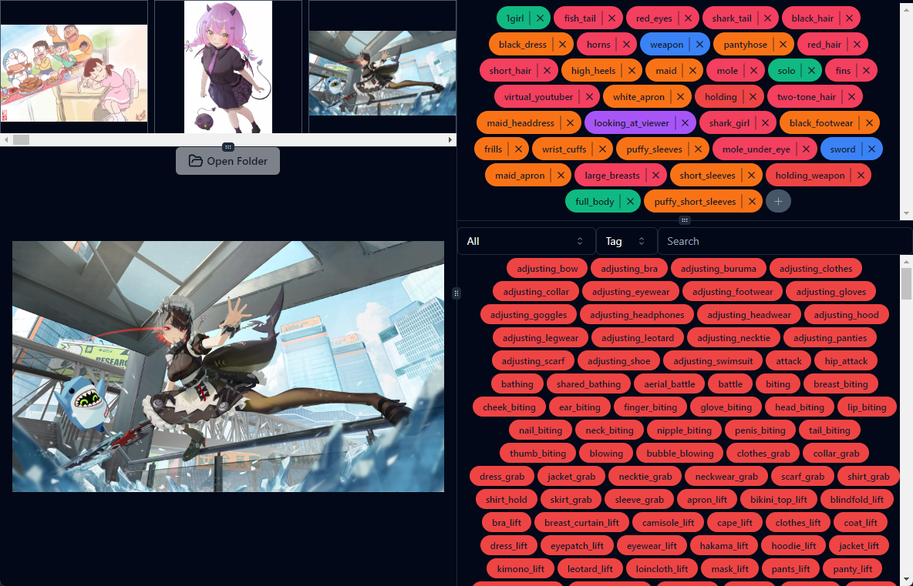
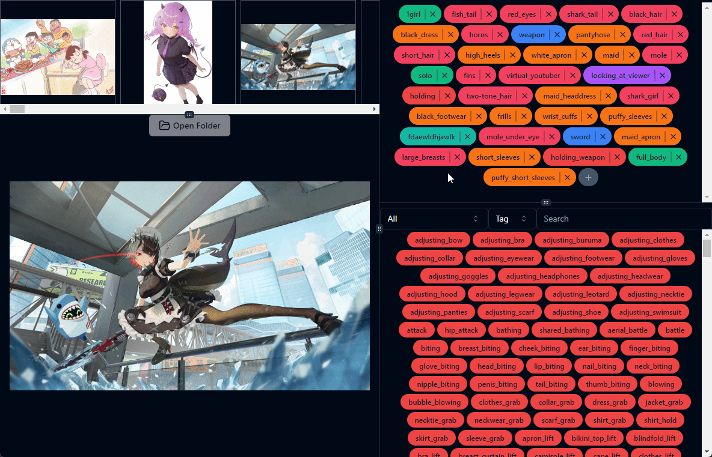
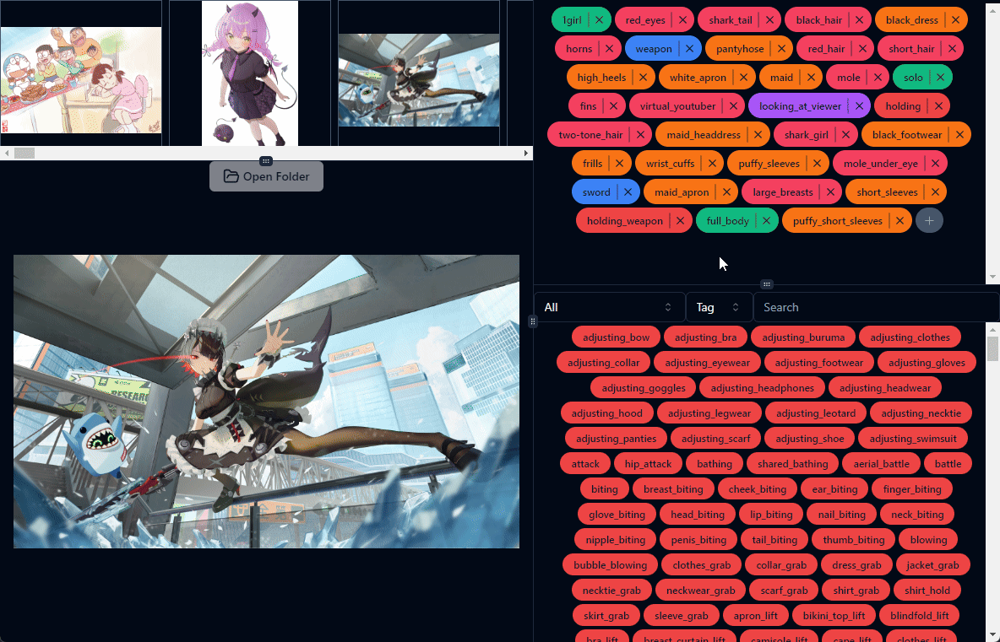

<h1 style="text-align: center">Booru Tag Editor UI</h1>

<p style="text-align: center">Booru Tag Editor UI is a desktop application built with Electron, React, and Shadcn/UI. It allows users to load image/text pairs of booru-style tags and edit tags for each image individually.</P>



## Features

- Load full folders of images
- Click on images in the gallery to swap active image and displayed tags
- Resizable panels for customizable workspace
- Undo and redo system (Ctrl+Z for undo, Ctrl+Y for redo)
- Automatic tag saving when switching images or closing the app
- Manual save option (Ctrl+S)
- Top-right panel:
  - Displays selected tags
  - Delete tags with 'X' button
  - Left and right click to filter tags
    - Left Click sets the category
    - Right click sets the category, group, and group name
  - Add arbitrary tags with '+' button
- Bottom-right panel:
  - Shows all available tags
  - Search and filter controls (by category, tag, or group)
  - Click tags to add them to the selected tags panel

## Showcase

<h3 style="text-align:center">Adjustable Panel</h3>


<h3 style="text-align: center">Tag Manipulation</h3>



<h3 style="text-align: center">Searching</h3>



## Installation

### Portable Executable

Go to the releases tab and find the most recent version for your system type, windows, or linux
unfortunately macos users will have to build it themselves. Please keep in mind, macos is _not_ officially supported

### Build It Yourself

```
git clone <url here>
yarn

then build using one of these commands
yarn build:win (if on windows)
yarn build:linux (if on linux)
yarn build:mac (if on macos)

find the executable in the "dist" folder and launch the exe
```

## Usage

1. Launch the Booru Tag Editor UI application
2. Click "Open Folder" to load a directory of images
3. Use the interface to view and edit tags for each image
4. Tags are automatically saved, or use Ctrl+S to save manually
